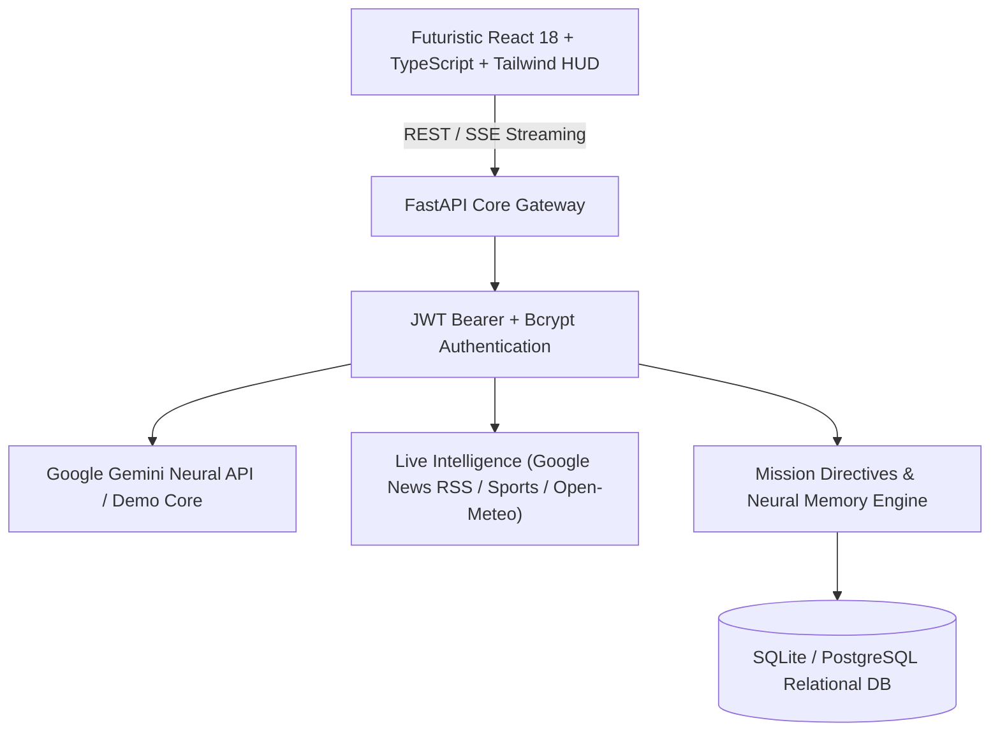

# J.A.R.V.I.S. AI
### Just A Rather Very Intelligent System — Autonomous AI Operating System & Command Center

[](https://github.com/anangipavan362-dotcom/JARVIS-AI/actions)
[](LICENSE)
[](https://www.python.org/)
[](https://react.dev/)
[](https://fastapi.tiangolo.com/)

---

## Overview

**J.A.R.V.I.S.** (Just A Rather Very Intelligent System) is a complete, futuristic, production-grade personal AI command-center web platform. Inspired by the legendary AI operating system, this platform delivers an immersive, cinematic, sci-fi cyber command hub loaded with full-stack capabilities, live world intelligence, voice synthesis, priority directive tracking, user data isolation, and adaptive Google Gemini AI neural heuristics.

> [!NOTE]
> **Preservation of Desktop JARVIS**:
> The existing Python Tkinter desktop JARVIS client (`jarvis.py`, `car_game.py`, `voice_jarvis_test.py`, `jarvis_hud.png`, etc.) is fully preserved in the [`desktop/`](desktop/) directory for offline and native Windows operations.

---

## Architectural Layout



```
JARVIS-AI/
├── desktop/                  # Preserved Python Tkinter desktop application
│   ├── jarvis.py
│   ├── car_game.py
│   ├── voice_jarvis_test.py
│   ├── jarvis_hud.png
│   ├── jarvis.png.png
│   └── start_jarvis.bat
├── web/
│   ├── frontend/             # Futuristic React 18 + TypeScript + Vite + Tailwind
│   │   ├── src/
│   │   │   ├── components/   # Arc Reactor HUD, Radar, Waveform, Widgets
│   │   │   ├── pages/        # Dashboard, Chat, Voice, News, Sports, Weather, etc.
│   │   │   ├── layouts/      # MainLayout, Cyber Sidebar, Telemetry Header
│   │   │   ├── context/      # AuthContext
│   │   │   ├── services/     # API Client & Endpoints
│   │   │   └── utils/        # Web Audio API Sound Synthesizer
│   │   ├── package.json
│   │   └── vite.config.ts
│   └── backend/              # Production FastAPI + SQLAlchemy + Pydantic v2
│       ├── app/
│       │   ├── models/       # Relational Schemas (User, Tasks, Memory, Sessions, etc.)
│       │   ├── routes/       # Auth, AI, Dashboard, News, Sports, Weather, Admin
│       │   ├── services/     # Gemini AI, RSS Aggregator, Open-Meteo, Search
│       │   └── auth/         # Bcrypt Hashing, JWT Tokens, Isolation Dependencies
│       ├── tests/            # Automated Pytest Suite (Isolation, Auth, Admin)
│       └── requirements.txt
├── .github/workflows/ci.yml  # Automated CI/CD verification pipeline
├── docker-compose.yml        # Multi-container production deployment
├── .env.example              # Zero-secret template
└── README.md
```

---

## Key Features

- **Futuristic Animated Arc Reactor**: Original SVG multi-ring rotating core with 6 dynamic energy states (`IDLE`, `LISTENING`, `THINKING`, `SPEAKING`, `ALERT`, `OFFLINE`).
- **Cinematic Startup Sequence**: System self-check sequence ("SYSTEM INITIALIZING... AI CORE ONLINE... J.A.R.V.I.S. ONLINE").
- **Voice Command Center**: Real-time browser speech recognition (`webkitSpeechRecognition`) coupled with neural speech synthesis and acoustic frequency visualizer bars.
- **Synthesized Audio Telemetry**: Authentic sci-fi acoustic feedback powered by the Web Audio API with a master mute toggle.
- **Dual AI Engine**:
  - **Live Mode**: Direct integration with Google Gemini generative models.
  - **JARVIS Demo Mode**: Automatically activates if `GEMINI_API_KEY` is not provided. Allows complete exploration without API credentials.
- **Real-Time Live Intelligence**:
  - **News**: Multi-category live RSS feeds (Top News, India, World, Tech, AI, Science, Business, Education).
  - **Sports**: Multi-sport intelligence (Cricket, Football, Formula 1, Tennis, Basketball).
  - **Weather**: Real-time global atmospheric sensors powered by Open-Meteo (no API key required).
  - **Tactical Web Search**: Aggregated query dispatch to Google, YouTube, Google Scholar, and arXiv.
- **Mission Tasks & Natural Reminders**: Priority classification (`LOW`, `MEDIUM`, `HIGH`, `URGENT`) with natural language query parsing.
- **Explicit Neural Memory Banks**: Explicit user-controlled parameter storage with inspection, editing, and purging.
- **Strict User Data Isolation**: Absolute backend enforcement preventing User A from accessing User B's conversations, memories, tasks, or settings.
- **System Telemetry & Health Gauges**: Real-time memory consumption, SQL latency, uptime counter, and traffic charts powered by Recharts.
- **Command Palette (`Ctrl + K`)**: Universal keyboard modal for instant navigation across all subsystems.
- **Admin Control Terminal**: Role-based access control (`ADMIN` role) with user roster management and audit metrics.
- **Privacy & Data Portability**: "DOWNLOAD MY DATA" (JSON export) and permanent self-serve account decommissioning.

---

## Environment Configuration

Create a `.env` file in the root or `web/backend/` using `.env.example` as a reference:

```env
# Google Gemini API Key (https://aistudio.google.com/)
# If empty, JARVIS operates in Demo Mode
GEMINI_API_KEY=

# Security Secret Key for JWT encryption
SECRET_KEY=jarvis-quantum-core-super-secret-key-change-in-production-2026

# Database Connection (SQLite default, PostgreSQL supported)
DATABASE_URL=sqlite:///./jarvis.db

# CORS Allowed Origins
CORS_ORIGINS=http://localhost:5173,http://localhost:3000,http://127.0.0.1:5173

# AI Model
GEMINI_MODEL=gemini-2.5-flash
```

---

## Local Development Setup

### 1. Backend Service

```bash
cd web/backend

# Create & activate virtual environment
python -m venv .venv
# On Windows:
.venv\Scripts\activate
# On Linux/macOS:
# source .venv/bin/activate

# Install dependencies
pip install -r requirements.txt

# Run FastAPI backend with Uvicorn
python -m uvicorn app.main:app --reload --port 8000
```

The backend will initialize database tables automatically and be accessible at `http://localhost:8000`. API documentation is available at `http://localhost:8000/docs`.

### 2. Frontend Application

```bash
cd web/frontend

# Install dependencies
npm install

# Start Vite development server
npm run dev
```

The frontend will run at `http://localhost:5173`.

---

## Automated Verification & Testing

### Backend Test Suite
The backend includes test coverage for authentication, admin privilege checks, feature endpoints, and strict user isolation:

```bash
cd web/backend
python -m pytest tests/ -v
```

### Frontend Typecheck & Build
```bash
cd web/frontend
npm run build
```

---

## Docker Deployment

Deploy both the backend and frontend using Docker Compose:

```bash
docker-compose up --build
```

- **Frontend**: `http://localhost:3000`
- **Backend API**: `http://localhost:8000`

---

## Security Directives

1. **No Arbitrary Shell Execution**: In compliance with strict AI safety standards, the browser JARVIS web application does not execute arbitrary OS terminal commands.
2. **Untrusted Content Sanitization**: External web and RSS feeds are treated as untrusted data.
3. **Zero Secret Leakage**: No credentials, private keys, or API tokens are hardcoded or committed into Git.

---

## Repository & Maintainer

- **GitHub Repository**: [https://github.com/anangipavan362-dotcom/JARVIS-AI](https://github.com/anangipavan362-dotcom/JARVIS-AI)
- **Author**: Anangi Pavan
