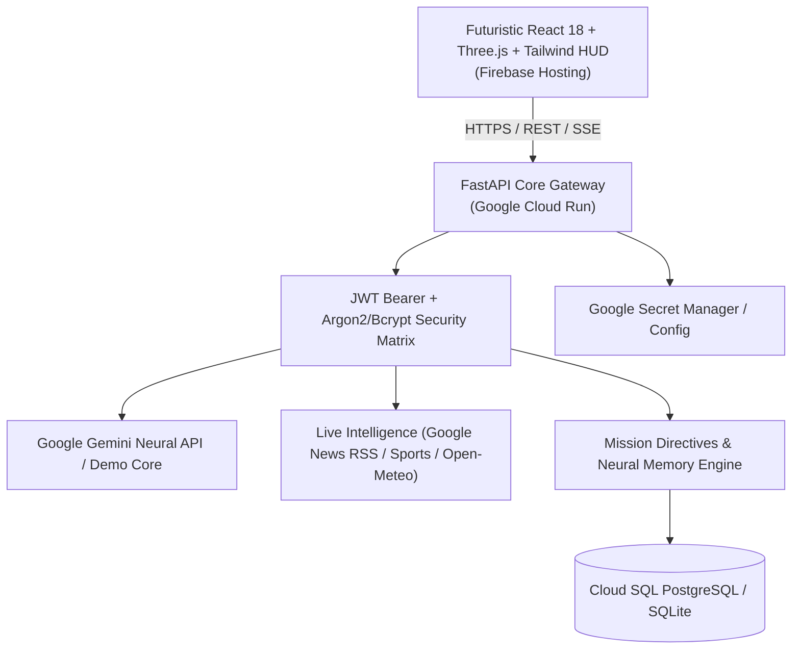

# J.A.R.V.I.S. AI
### Just A Rather Very Intelligent System — Autonomous AI Operating System & Command Center

[](https://github.com/anangipavan362-dotcom/JARVIS-AI/actions)
[](LICENSE)
[](https://www.python.org/)
[](https://react.dev/)
[](https://fastapi.tiangolo.com/)
[](https://cloud.google.com/run)
[](https://firebase.google.com/docs/hosting)

---

## Overview

**J.A.R.V.I.S.** (Just A Rather Very Intelligent System) is a complete, futuristic, production-grade personal AI command-center web platform. Inspired by the legendary AI operating system, this platform delivers an immersive, cinematic, sci-fi cyber command hub loaded with full-stack capabilities:
- **Interactive 3D WebGL Holographic Visualizations** (Three.js quantum core and energy fields)
- **Cinematic Arc Reactor HUD** with real-time acoustic telemetry and speech synthesis
- **Live Global Sensory Networks** (Real-time Google News RSS, Sports telemetry, Open-Meteo atmospheric sensors)
- **Autonomous Mission Directives & Neural Memory Banks**
- **Strict Role-Based Access Control (RBAC)** with MFA/OTP verification and encrypted sessions
- **Dual AI Engine**: Seamless fallback from live Google Gemini generative models to local adaptive heuristics
- **Complete Visual Infrastructure**: High-definition futuristic command-center assets with fail-safe zero-broken-image fallbacks
- **Cloud-Ready Microservices**: Deployable to **Google Cloud Run** (Backend) and **Firebase Hosting** (Frontend)

> [!NOTE]
> **Preservation of Desktop JARVIS**:
> The original Python Tkinter desktop JARVIS client (`jarvis.py`, `car_game.py`, `voice_jarvis_test.py`, `jarvis_hud.png`, etc.) is fully preserved in the [`desktop/`](desktop/) directory for offline and native Windows operations.

---

## Architectural Layout


```mermaid
graph TD
    Client["Futuristic React 18 + Three.js + Tailwind HUD<br/>(Firebase Hosting)"] -->|HTTPS / REST / SSE| Gateway["FastAPI Core Gateway<br/>(Google Cloud Run)"]
    Gateway --> Security["JWT Bearer + Argon2/Bcrypt Security Matrix"]
    Security --> AISvc["Google Gemini Neural API / Demo Core"]
    Security --> LiveSvc["Live Intelligence (Google News RSS / Sports / Open-Meteo)"]
    Security --> TaskMem["Mission Directives & Neural Memory Engine"]
    TaskMem --> DB[(Cloud SQL PostgreSQL / SQLite)]
    Gateway --> SM["Google Secret Manager / Config"]
```

```
JARVIS-AI/
├── desktop/                  # Preserved Python Tkinter desktop application
│   ├── jarvis.py
│   ├── car_game.py
│   ├── voice_jarvis_test.py
│   ├── jarvis_hud.png
│   ├── jarvis.png.png
│   └── start_jarvis.bat
├── docs/
│   └── image-licenses.md     # Full image licensing and visual asset documentation
├── backend/                  # Production FastAPI + SQLAlchemy + Alembic
│   ├── alembic/              # Alembic database migrations
│   │   ├── env.py
│   │   └── versions/         # Migration versions (14 relational models)
│   ├── app/
│   │   ├── models/           # Relational Schemas (User, Session, OTP, AuditLog, etc.)
│   │   ├── routes/           # Auth, AI, Dashboard, News, Sports, Weather, Admin
│   │   ├── services/         # Gemini AI, RSS Aggregator, Open-Meteo, Search
│   │   └── config.py         # Dynamic environment and Cloud Run configuration
│   ├── tests/                # Automated Pytest Suite (Isolation, Auth, Admin, etc.)
│   ├── Dockerfile            # Cloud Run multi-stage Dockerfile ($PORT support)
│   └── requirements.txt
├── web/
│   └── frontend/             # Futuristic React 18 + Three.js + Vite + Tailwind
│       ├── public/
│       │   └── images/       # High-definition imagery (hero, ai, security, fallback)
│       ├── src/
│       │   ├── components/   # AICore 3D, Arc Reactor HUD, ImageWithFallback
│       │   ├── pages/        # Landing (16 sections), Dashboard, Chat, Admin, etc.
│       │   ├── layouts/      # MainLayout, Cyber Sidebar, Telemetry Header
│       │   ├── context/      # AuthContext
│       │   └── services/     # API Client & Endpoints
│       ├── firebase.json     # Firebase Hosting SPA routing configuration
│       ├── package.json
│       └── vite.config.ts
├── .github/workflows/ci.yml  # Automated CI/CD verification pipeline
├── docker-compose.yml        # Multi-container production deployment
└── README.md
```

---

## Key Features

- **16-Section Command Center Landing Experience**: High-tech cinematic hero with Three.js 3D WebGL particle core, real command-center backdrops, live sensor telemetry, platform capabilities, and responsive FAQ accordion.
- **Fail-Safe Visual Architecture**: Reusable `ImageWithFallback` component ensures 0% broken image states with SVG HUD fallbacks. Documented in [`docs/image-licenses.md`](docs/image-licenses.md).
- **Futuristic Animated Arc Reactor**: Original SVG multi-ring rotating core with 6 dynamic energy states (`IDLE`, `LISTENING`, `THINKING`, `SPEAKING`, `ALERT`, `OFFLINE`).
- **Cinematic Startup Sequence**: System self-check sequence ("SYSTEM INITIALIZING... AI CORE ONLINE... J.A.R.V.I.S. ONLINE").
- **Voice Command Center**: Real-time browser speech recognition (`webkitSpeechRecognition`) coupled with neural speech synthesis and acoustic frequency visualizer bars.
- **Synthesized Audio Telemetry**: Authentic sci-fi acoustic feedback powered by the Web Audio API with a master mute toggle.
- **Dual AI Engine**:
  - **Live Mode**: Direct integration with Google Gemini generative models.
  - **JARVIS Demo Mode**: Automatically activates if `GEMINI_API_KEY` is not provided. Allows complete exploration without API credentials.
- **Real-Time Live Intelligence**:
  - **News**: Multi-category live RSS feeds (Top News, India, World, Tech, AI, Science, Business, Education).
  - **Sports**: Multi-sport intelligence (Cricket, Football, Formula 1, Tennis, Basketball).
  - **Weather**: Real-time global atmospheric sensors powered by Open-Meteo (no API key required).
  - **Tactical Web Search**: Aggregated query dispatch to Google, YouTube, Google Scholar, and arXiv.
- **Mission Tasks & Natural Reminders**: Priority classification (`LOW`, `MEDIUM`, `HIGH`, `URGENT`) with natural language query parsing.
- **Explicit Neural Memory Banks**: Explicit user-controlled parameter storage with inspection, editing, and purging.
- **Strict User Data Isolation**: Absolute backend enforcement preventing User A from accessing User B's conversations, memories, tasks, or settings.
- **System Telemetry & Health Gauges**: Real-time memory consumption, SQL latency, uptime counter, and traffic charts powered by Recharts.
- **Command Palette (`Ctrl + K`)**: Universal keyboard modal for instant navigation across all subsystems.
- **Admin Control Terminal**: Role-based access control (`ADMIN` role) with user roster management and audit metrics.
- **Privacy & Data Portability**: "DOWNLOAD MY DATA" (JSON export) and permanent self-serve account decommissioning.

---

## Environment Configuration

Create a `.env` file in `backend/` using `backend/.env.example` as a reference:

```env
# Operational Environment (development / production)
ENVIRONMENT=production

# Application Version
VERSION=2.5.0

# Google Gemini API Key (https://aistudio.google.com/)
# If left blank, JARVIS seamlessly operates in intelligent Demo Mode
GEMINI_API_KEY=

# Security Secret Key for JWT encryption (Change in production!)
SECRET_KEY=jarvis-quantum-core-super-secret-key-change-in-production-2026

# Database Connection (SQLite local, or PostgreSQL / Cloud SQL in production)
DATABASE_URL=sqlite:///./jarvis.db

# CORS Allowed Origins (Comma-separated)
CORS_ORIGINS=http://localhost:5173,https://YOUR-FIREBASE-PROJECT.web.app,https://YOUR-FIREBASE-PROJECT.firebaseapp.com

# AI Model
GEMINI_MODEL=gemini-2.5-flash
```

For the frontend, specify the backend URL in `web/frontend/.env`:
```env
VITE_API_URL=https://your-cloud-run-backend-url.run.app
```

---

## Local Development Setup

### 1. Backend Service

```bash
cd backend

# Create & activate virtual environment
python -m venv .venv
# On Windows:
.venv\Scripts\activate
# On Linux/macOS:
# source .venv/bin/activate

# Install dependencies
pip install -r requirements.txt

# Run database migrations
alembic upgrade head

# Run FastAPI backend with Uvicorn
python -m uvicorn app.main:app --reload --port 8000
```

The backend is accessible at `http://localhost:8000`. API documentation is available at `http://localhost:8000/docs`.

### 2. Frontend Application

```bash
cd web/frontend

# Install dependencies
npm install

# Start Vite development server
npm run dev
```

The frontend will run at `http://localhost:5173`.

---

## Database Migrations (Alembic)

The application uses **Alembic** to manage database schemas across SQLite and production PostgreSQL/Cloud SQL:

```bash
cd backend

# Apply all migrations to the latest revision
alembic upgrade head

# Roll back the most recent migration
alembic downgrade -1

# Generate a new migration after modifying app/models/
alembic revision --autogenerate -m "Add new column or model"
```

---

## Automated Verification & Testing

### Backend Test Suite
The backend includes 100% automated test coverage for authentication, OTP verification, admin privilege checks, feature endpoints, and strict user isolation:

```bash
cd backend
python -m pytest tests/ -v
```

### Frontend Typecheck & Production Build
```bash
cd web/frontend
npm run build
```

---

## Production Cloud Deployment

### 1. Backend Deployment to Google Cloud Run

The backend includes a production-optimized `Dockerfile` supporting Google Cloud Run's dynamic `$PORT` environment variable and graceful shutdown signals.

```bash
# Set your Google Cloud project ID
export PROJECT_ID="your-gcp-project-id"

# 1. Build and push the container image using Cloud Build
gcloud builds submit --tag gcr.io/$PROJECT_ID/jarvis-backend backend

# 2. Deploy to Google Cloud Run
gcloud run deploy jarvis-backend \
  --image gcr.io/$PROJECT_ID/jarvis-backend \
  --platform managed \
  --region us-central1 \
  --allow-unauthenticated \
  --set-env-vars "ENVIRONMENT=production,SECRET_KEY=YOUR_SECURE_SECRET" \
  --memory 1Gi \
  --cpu 1

# Note the returned Service URL, e.g.:
# https://jarvis-backend-xyz123-uc.a.run.app
```

> [!TIP]
> **Connecting to Google Cloud SQL (PostgreSQL)**:
> In production, configure Cloud SQL and pass the connection string via Secret Manager:
> `DATABASE_URL=postgresql://jarvis_user:PASSWORD@/jarvis_db?host=/cloudsql/PROJECT_ID:REGION:INSTANCE_NAME`

---

### 2. Frontend Deployment to Google Firebase Hosting

The frontend contains pre-configured `firebase.json` with SPA URL rewrites:

```bash
cd web/frontend

# 1. Ensure production API URL points to your Cloud Run backend
echo "VITE_API_URL=https://jarvis-backend-xyz123-uc.a.run.app" > .env.production

# 2. Build the optimized production bundle
npm run build

# 3. Authenticate with Firebase (one-time interactive login)
npx firebase login

# 4. Deploy directly to Firebase Hosting
npx firebase deploy --only hosting
```

Your web application will be live at:
- `https://PROJECT-ID.web.app`
- `https://PROJECT-ID.firebaseapp.com`

---

## Security Directives

1. **No Arbitrary Shell Execution**: In compliance with strict AI safety standards, the browser JARVIS web application does not execute arbitrary OS terminal commands.
2. **Untrusted Content Sanitization**: External web and RSS feeds are treated as untrusted data.
3. **Zero Secret Leakage**: No credentials, private keys, or API tokens are hardcoded or committed into Git.
4. **Data Isolation**: Multi-tenant database schema with strict user boundaries verified via automated pytest suites.

---

## Repository & Maintainer

- **GitHub Repository**: [https://github.com/anangipavan362-dotcom/JARVIS-AI](https://github.com/anangipavan362-dotcom/JARVIS-AI)
- **Author**: Anangi Pavan
